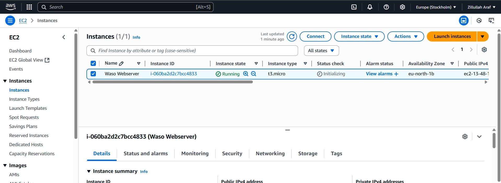
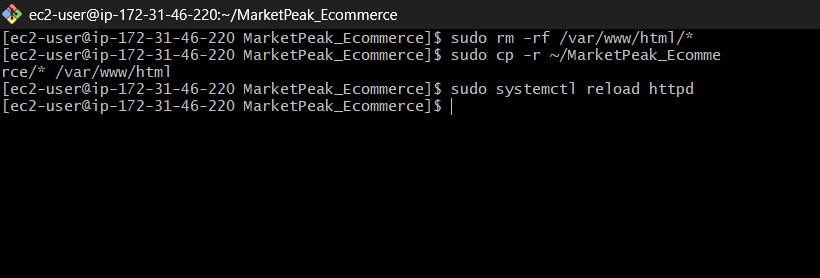

# MarketPeak E-Commerce Platform Deployment

## Project Overview

This project documents the deployment of "MarketPeak," an e-commerce platform. The implementation involves setting up version control with Git, preparing the website using a template, and deploying it on an AWS EC2 instance with Apache web server. The documentation also covers the continuous integration and deployment workflow for future updates.

## 1. Version Control with Git

### 1.1 Initialize Git Repository

I created a project directory and initialized a Git repository to manage version control:

```
mkdir MarketPeak_Ecommerce
cd MarketPeak_Ecommerce
git init
```


### 1.2 Obtain and Prepare Website Template

Instead of building from scratch, I used a pre-existing e-commerce template:

1. Downloaded the Tooplate 2130 Waso Strategy template from [Tooplate](https://www.tooplate.com/view/2130-waso-strategy)
2. Extracted the template into the project directory

### 1.3 Stage and Commit Template to Git

After preparing the template, I staged and committed the files to the local Git repository:

```bash
git add .
git commit -m "added waso_stratey website template to the repository"
```


### 1.4 Push Code to GitHub Repository

I then created a remote repository on GitHub and pushed my local code:

1. Created a new repository named "MarketPeak_Ecommerce" on GitHub
2. Linked the local repository to GitHub
3. Pushed the code to the remote repository

```bash
git remote add origin git@github.com:myusername/MarketPeak_Ecommerce.git
git branch -M main
git push -u origin main
```


## 2. AWS Deployment

### 2.1 Set Up AWS EC2 Instance

I set up an EC2 instance to host the MarketPeak e-commerce platform:

1. Logged into AWS Management Console
2. Launched a new EC2 instance with Amazon Linux 2
3. Configured security groups to allow HTTP (port 80) and SSH (port 22) traffic
4. Created and downloaded a key pair for SSH access



### 2.2 Clone Repository on Linux Server

After connecting to the EC2 instance, I cloned the GitHub repository:

```bash
# SSH into EC2 instance
ssh -i "waso_keypair.pem" ec2-user@ec2-13-48-136-9.eu-north-1.compute.amazonaws

# Clone the repository using HTTPS
git clone https://github.com/myusername/MarketPeak_Ecommerce.git
```


### 2.3 Install Web Server on EC2

I installed and configured Apache HTTP Server (httpd) on the EC2 instance:

```bash
# Update the system
sudo yum update -y

# Install Apache
sudo yum install httpd -y

# Start Apache service
sudo systemctl start httpd

# Enable Apache to start on boot
sudo systemctl enable httpd

# Check status to verify Apache is running
sudo systemctl status httpd
```


### 2.4 Configure httpd for Website

I configured Apache to serve the MarketPeak website files:

```bash
# Move website files to Apache's document root
sudo cp -r MarketPeak_Ecommerce/* /var/www/html/

```



### 2.5 Access Website from Browser

After deployment, I accessed the website using the EC2 instance's public IP address:

```
http://13.48.136.9/2130_waso_strategy/
```


## 3. Continuous Integration and Deployment Workflow

### 3.1 Developing New Features

For ongoing development, I followed these steps:

1. Created a feature branch from main
2. Implemented new features - specifically customizing the website for MarketPeak

```bash
git branch development
git checkout development
```


The main customizations included:

1. Update the contact phone number and email address on the website


### 3.3 Pull Requests and Merging

To integrate changes into the main branch:

1. Pushed the change to the remote git hub repository
2. Created a pull request on GitHub to merge the feature branch into main
4. Reviewed the changes to ensure they met requirements
5. Merged the pull request


### 3.4 Deploying Updates to Production

To deploy new changes to the live server:

```bash
# SSH into EC2 instance
ssh -i "waso_keypair.pem" ec2-user@ec2-13-48-136-9.eu-north-1.compute.amazonaws

# Navigate to website directory
cd /var/www/html

# Pull latest changes from main branch
sudo git pull origin main

# Restart Apache if necessary
sudo systemctl restart httpd
```


### 3.5 Testing New Changes

After deployment, I verified the changes on the live site.

